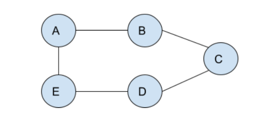

# Distance Vector Routing

---

### Description

Implementing distance vector routing for the topology given below:



Initially, every node knows only its one-hop neighbors. The routing tables are updated periodically. Let's say at time t=0, there is no exchange in the routing tables and every node knows its immediate neighbors only. At time t = 1, nodes share their routing table with their immediate neighbors and every receiving node updates its routing table. The routing tables will be shared in alphabetical order, i.e, first node A will share its routing table with its neighbors, then B, C, D, and E. Likewise, the routing tables are updated periodically at time t = 1, 2, 3, ..., so on. 
Answering the following questions:
1. After how many rounds of updation every node can reach every other node in the network. Answer in terms of the value of t, i.e., t =? Display the updated routing tables for all nodes at every step.

2. Now, assume that the routing tables are stabilized after t = x steps (x = your answer in part 1). At t = x+1, link BC breaks. Since the network is updated periodically, at step t = x+2 routing table of node B will be updated. Show after how many steps the network stabilizes again. Use the split horizon method in case an infinite loop happens. Show the updated routing tables of all nodes after the network stabilizes.

### Implementation

**1. How to compile and run this program**

**Running the code**
To run the program, use the following command:
`python main.py`

**2. Output of the program**
```
In the following outputs, each row depicts the routing table corresponding to the router(or node) 
printed at the head of the row.
The entries in the routing table comprise of the distance and the next hop router values.

t =  0
A|  0A 1B ∞  ∞  1E
B|  1A 0B 1C ∞  ∞
C|  ∞  1B 0C 1D ∞
D|  ∞  ∞  1C 0D 1E
E|  1A ∞  ∞  1D 0E

t =  1
A|  0A 1B 2B 2E 1E
B|  1A 0B 1C 2C 2A
C|  2B 1B 0C 1D 2D
D|  2E 2C 1C 0D 1E
E|  1A 2A 2D 1D 0E

After t = 1 , every node can reach every other node in the network.

At t = 2 , link BC breaks.

t = 3
Distance vectors after the link BC is broken:
A|  0A 1B 2B 2E 1E
B|  1A 0B ∞  ∞  2A
C|  ∞  ∞  0C 1D 2D
D|  2E 2C 1C 0D 1E
E|  1A 2A 2D 1D 0E
```
```
t =  4
A|  0A 1B 3E 2E 1E
B|  1A 0B ∞  3A 2A
C|  3D ∞  0C 1D 2D
D|  2E 3E 1C 0D 1E
E|  1A 2A 2D 1D 0E

t =  5
A|  0A 1B 3E 2E 1E
B|  1A 0B 4A 3A 2A
C|  3D 4D 0C 1D 2D
D|  2E 3E 1C 0D 1E
E|  1A 2A 2D 1D 0E

After t = 5 , the network stabilizes again.
```
